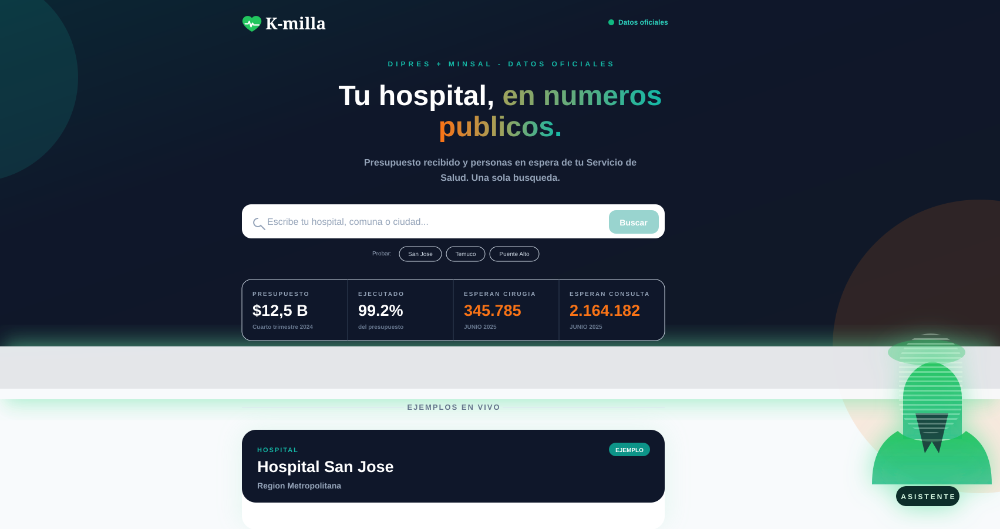

# K-milla

> Datos públicos de salud chilena, conectados. Paquete: `k-milla`.

**¿Llegó la plata a tu hospital? ¿Cuántas personas están esperando atención?**

Conecta el presupuesto público de salud (DIPRES) con las listas de espera de tu Servicio de Salud (MINSAL). Una sola búsqueda. Datos públicos. Lenguaje humano.



---

## El Problema

En Chile, ~15 millones de personas dependen de la salud pública. La ejecución presupuestaria está en DIPRES y las listas de espera están en el Visor MINSAL — en mundos separados que nunca se cruzan. Este proyecto construye el puente.

## Qué Hace

1. El ciudadano escribe su hospital, comuna o ciudad.
2. En segundos recibe:
   - Cuánto presupuesto recibió su **Servicio de Salud regional** (DIPRES, último corte oficial)
   - Cuánto se ejecutó (devengado sobre vigente, con % visual)
   - Cuántas personas están en lista de espera de cirugía y de consulta de especialidad en esa misma red (MINSAL, último trimestre publicado)
   - Sparkline con la evolución de los últimos 8 trimestres
   - Variación interanual contra el mismo trimestre del año anterior
   - Párrafo descriptivo en lenguaje simple
   - Asistente conversacional que solo responde con cifras del contexto inyectado, nunca inventa

Banner nacional en el hero: presupuesto vigente total + ejecución agregada + total nacional de personas esperando — todo con count-up animado.

## Principios Innegociables

- **Honestidad de unidad**: DIPRES y MINSAL se muestran por Servicio de Salud. El hospital o comuna es solo la puerta de entrada de la búsqueda.
- **Cero veredictos**: párrafos descriptivos, sin acusaciones.
- **Sin tiempo real**: datos pre-ingresados, actualizables con scripts.
- **Primera impresión clara**: una sola caja, cero jerga.

---

## Stack Técnico

- **Framework**: Next.js 16 con App Router y Turbopack
- **Lenguaje**: TypeScript
- **Estilos**: Tailwind CSS
- **Package manager**: npm (`package-lock.json`)
- **Datos**: JSON estático pre-ingresado (sin base de datos)
- **Deploy**: Vercel (free tier)

## Estructura del Repositorio

```
k-milla/
├── data/
│   ├── mapping.json           ← TABLA MAESTRA: commune/hospital → Servicio de Salud
│   ├── dipres_ejecucion.json  ← Presupuesto por Servicio de Salud (DIPRES)
│   └── minsal_espera.json     ← Lista de espera por Servicio de Salud (MINSAL)
├── scripts/
│   ├── ingest_dipres.mjs      ← Actualiza datos DIPRES desde XML oficial
│   └── ingest_minsal.mjs      ← Actualiza datos MINSAL desde JSON oficial
├── src/
│   ├── app/
│   │   ├── api/search/        ← API de búsqueda
│   │   ├── api/heroes/        ← Ejemplos de búsqueda
│   │   ├── api/chat/          ← Asistente conversacional
│   │   └── page.tsx           ← Página principal
│   ├── components/
│   │   ├── SearchClient.tsx   ← UI interactiva
│   │   └── ChatAssistant.tsx  ← Asistente de consulta
│   └── lib/
│       ├── types.ts           ← Tipos TypeScript
│       ├── search.ts          ← Motor de búsqueda
│       └── format.ts          ← Formateo y generación de párrafos
└── README.md
```

---

## Tabla de Mapeo (data/mapping.json)

La tabla de mapeo es el corazón del proyecto. Conecta:

```
nombre de hospital / comuna → Servicio de Salud (para datos DIPRES)
nombre de hospital          → Servicio de Salud (para datos MINSAL)
```

### Servicios de Salud incluidos (28 servicios)

| ID | Nombre | Región |
|---|---|---|
| ss_metro_norte | Servicio de Salud Metropolitano Norte | RM |
| ss_metro_occidente | Servicio de Salud Metropolitano Occidente | RM |
| ss_metro_central | Servicio de Salud Metropolitano Central | RM |
| ss_metro_oriente | Servicio de Salud Metropolitano Oriente | RM |
| ss_metro_sur | Servicio de Salud Metropolitano Sur | RM |
| ss_metro_sur_oriente | Servicio de Salud Metropolitano Sur Oriente | RM |
| ss_valparaiso_sa | Servicio de Salud Valparaíso - San Antonio | Valparaíso |
| ss_vina_quillota | Servicio de Salud Viña del Mar - Quillota | Valparaíso |
| ss_aconcagua | Servicio de Salud Aconcagua | Valparaíso |
| ss_ohiggins | Servicio de Salud Libertador B. O'Higgins | O'Higgins |
| ss_maule | Servicio de Salud Maule | Maule |
| ss_nuble | Servicio de Salud Ñuble | Ñuble |
| ss_biobio | Servicio de Salud Biobío | Biobío |
| ss_talcahuano | Servicio de Salud Talcahuano | Biobío |
| ss_arauco | Servicio de Salud Arauco | Biobío |
| ss_araucania_norte | Servicio de Salud Araucanía Norte | Araucanía |
| ss_araucania_sur | Servicio de Salud Araucanía Sur | Araucanía |
| ss_valdivia | Servicio de Salud Valdivia | Los Ríos |
| ss_osorno | Servicio de Salud Osorno | Los Lagos |
| ss_reloncavi | Servicio de Salud del Reloncaví | Los Lagos |
| ss_chiloe | Servicio de Salud Chiloé | Los Lagos |
| ss_aysen | Servicio de Salud Aysén | Aysén |
| ss_magallanes | Servicio de Salud Magallanes | Magallanes |
| ss_coquimbo | Servicio de Salud Coquimbo | Coquimbo |
| ss_atacama | Servicio de Salud Atacama | Atacama |
| ss_antofagasta | Servicio de Salud Antofagasta | Antofagasta |
| ss_tarapaca | Servicio de Salud Tarapacá | Tarapacá |
| ss_arica_parinacota | Servicio de Salud Arica y Parinacota | Arica y Parinacota |

### Ejemplos de Búsqueda

Estas tres búsquedas existen en el mapeo inicial y sirven para probar la experiencia:

| Búsqueda | Servicio de Salud | Hospital Principal |
|---|---|---|
| "Hospital San José" / "Recoleta" | SS Metropolitano Norte | Hospital San José |
| "Temuco" / "Hospital Regional Temuco" | SS Araucanía Sur | Hospital H. Henríquez Aravena |
| "Valparaíso" / "Hospital Carlos Van Buren" | SS Valparaíso - San Antonio | Hospital Dr. Carlos Van Buren |

---

## Fuentes de Datos

### DIPRES
- **URL**: https://www.dipres.gob.cl/597/w3-multipropertyvalues-15149-35869.html
- **Qué publica**: Ejecución presupuestaria por Servicio de Salud (XML/CSV)
- **Partida**: 16 - Ministerio de Salud
- **Unidad**: Cada Servicio de Salud como organismo
- **Frecuencia**: Mensual, con corte a fin de mes

### MINSAL - Visor Ciudadano
- **URL**: https://www.listaesperasalud.cl/
- **Qué publica**: Listas de espera por Servicio de Salud (consultas y cirugías)
- **Unidad**: Servicio de Salud
- **Frecuencia**: Mensual

---

## Instalación y Desarrollo

```bash
# Instalar dependencias
npm install

# Iniciar servidor de desarrollo
npm run dev

# Build de producción
npm run build
```

## Variables de entorno

| Variable | Dónde | Necesaria para | Si falta |
|---|---|---|---|
| `MINIMAX_API_KEY` | Solo servidor (Vercel → Project Settings → Environment Variables) | Asistente conversacional (`/api/chat`) | La API responde 503 y el chat muestra un mensaje informativo. El buscador y los datos siguen funcionando. |

La key vive exclusivamente en el servidor (`src/app/api/chat/route.ts`). Nunca se expone al cliente. No se commitea ningún archivo `.env*`.

## Actualizar Datos (un comando)

Regla de integridad: cada cifra en `data/` debe venir de una fuente oficial trazable o quedar como `null`. Todo dato real/null debe documentarse en `data/_data_audit.md`.

Los scripts son Node puro (cero dependencias extra) y descargan directamente desde los endpoints oficiales:

```bash
# Refrescar DIPRES (XML por servicio desde dipres.gob.cl)
npm run ingest:dipres

# Refrescar MINSAL (JSON por servicio desde listaesperasalud.cl)
npm run ingest:minsal

# Ambos
npm run ingest
```

Cada script:

- Recorre los 28 Servicios de Salud
- Si la fuente devuelve 200 con la cifra esperada → escribe la cifra y la URL en `data/*.json`
- Si la fuente falla o devuelve `null` → escribe `null` con `nota` describiendo el motivo (regla CLAUDE.md #1)
- Calcula variación interanual MINSAL contra el mismo trimestre del año anterior
- Guarda los últimos 8 trimestres como `historico` para los sparklines

Después de un refresh, ver `git diff data/` para confirmar qué cambió, actualizar `data/_data_audit.md` si la metodología cambió, y commitear:

```bash
git add data/
git commit -m "data: refresh dipres+minsal a [PERIODO]"
git push
# Vercel re-deploya automáticamente
```

---

## Deploy en Vercel

El proyecto incluye `vercel.json` mínimo. Pasos manuales:

```bash
npm i -g vercel
vercel link        # vincular al proyecto Vercel
vercel env add MINIMAX_API_KEY   # opcional, solo si quieres el chat
vercel --prod      # deploy producción
```

Sin `MINIMAX_API_KEY` el buscador, los datos y la UI funcionan al 100% — solo el chat responde 503 con un mensaje informativo.

---

## Contribuir

1. Fork el repositorio
2. Mejora la tabla de mapeo en `data/mapping.json`
3. Agrega más hospitales o comunas
4. Envía Pull Request

**Prioridades de contribución:**
- Completar el mapeo de todas las comunas de Chile
- Agregar más hospitales y establecimientos
- Mejorar los scripts de ingesta para automatizar la actualización
- Mejorar el algoritmo de búsqueda fuzzy

---

## Licencia

MIT License — libre para usar, modificar y distribuir.

---

*K-milla — proyecto para Hack@LATAM 2026, track Transparency & Corruption.*
*Datos públicos de DIPRES y MINSAL Chile.*
